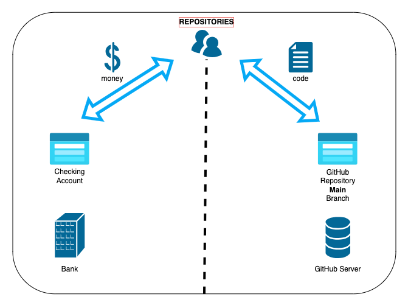

# Repository Name

Welcome to the `medium-ng` repository!

This repository contains the source code for various apps and code
discussed in articles published on Medium.

Below is a list of articles and their corresponding source code (if applicable).

## Articles

|                                                                    | Title                                                                                                                                                                     | Links                                                                                                                                                        |
|--------------------------------------------------------------------|---------------------------------------------------------------------------------------------------------------------------------------------------------------------------|--------------------------------------------------------------------------------------------------------------------------------------------------------------|
|   | [GitHub 101 through Financial Metaphors: Key Concepts](https://medium.com/@geeks.sw.gig/github-101-through-financial-metaphors-key-concepts-4523ee0a231c)                 | [Check On Medium ](https://medium.com/@geeks.sw.gig/github-101-through-financial-metaphors-key-concepts-4523ee0a231c)                                        |
|  | [Fantastic FinTech —An Awesome Opportunity Cost WebApp with Angular 15](https://medium.com/@geeks.sw.gig/fintech-bits-an-opportunity-cost-angular-app-7668b4682573)       | [Check On Medium ](https://medium.com/@geeks.sw.gig/fintech-bits-an-opportunity-cost-angular-app-7668b4682573), [View Source Code](opportunity-cost/)        |
|          | [3 Simple Steps to Turn Your Angular App into a Chrome Extension Masterpiece](https://medium.com/@geeks.sw.gig/fintech-bits-an-opportunity-cost-angular-app-7668b4682573) | [Check On Medium ](https://medium.com/@geeks.sw.gig/convert-angular-web-app-to-chrome-extension-251b278d5436), [View Source Code](opportunity-cost-chromex/) |
